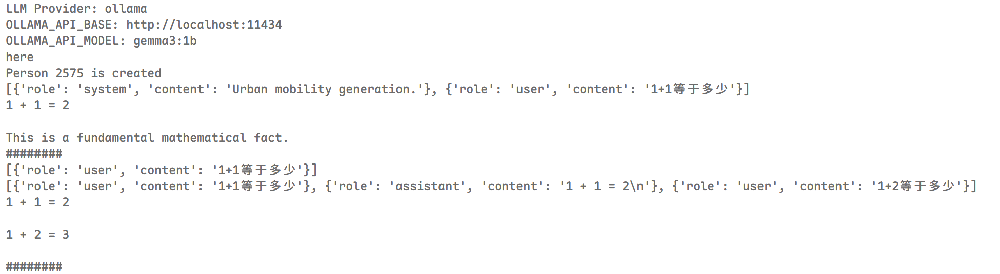
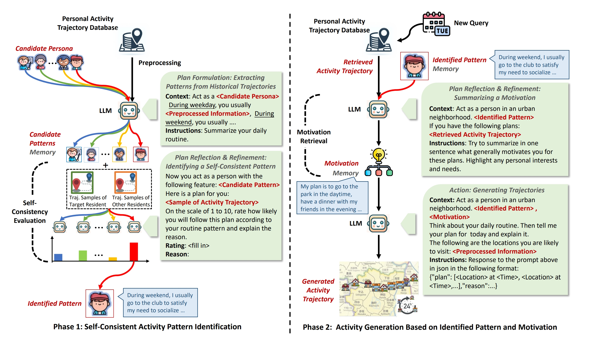
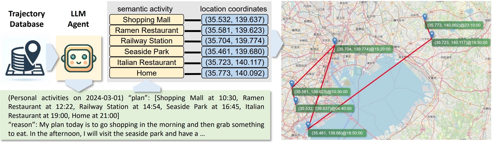
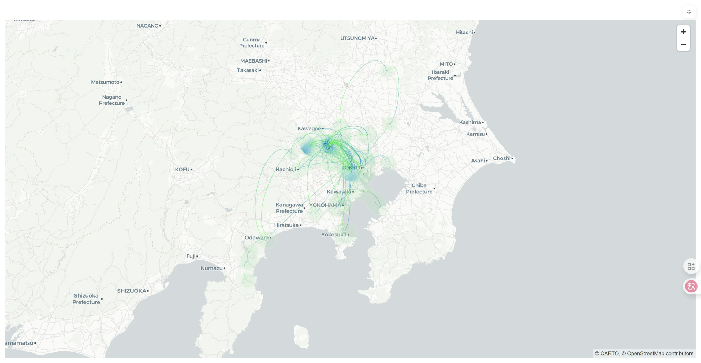

<a href='https://proceedings.neurips.cc/paper_files/paper/2024/file/e142fd2b70f10db2543c64bca1417de8-Paper-Conference.pdf'></a> 
<a href='https://arxiv.org/pdf/2402.14744'></a> 
[](https://github.com/agiresearch/OpenAGI/blob/main/LICENSE)


# screenshots
```python
print(P.llm.ask("1+1等于多少"), end="\n########\n")  
print(P.llm.ask_batch(["1+1等于多少", "1+2等于多"]),end="\n########\n")
```

===============Think about motivation=========================
===============one_shot_infer_response_72/72_0=========================
Expecting value: line 1 column 1 (char 0)
===============one_shot_infer_response_72/72_1=========================
Expecting value: line 1 column 1 (char 0)
===============one_shot_infer_response_72/72_2=========================
Expecting value: line 1 column 1 (char 0)
===============one_shot_infer_response_72/72_3=========================
Expecting value: line 1 column 1 (char 0)
===============one_shot_infer_response_72/72_4=========================
Expecting value: line 1 column 1 (char 0)
===============one_shot_infer_response_72/72_5=========================
Expecting value: line 1 column 1 (char 0)
===============one_shot_infer_response_72/72_6=========================
Expecting value: line 1 column 1 (char 0)
===============one_shot_infer_response_72/72_7=========================
Expecting value: line 1 column 1 (char 0)
===============one_shot_infer_response_72/72_8=========================
Expecting value: line 1 column 1 (char 0)
===============one_shot_infer_response_72/72_9=========================
Expecting value: line 1 column 1 (char 0)
```json
{"plan": ["Convenience Store#2117 at 10:00", "Bookstore#663 at 10:30", "Japanese Restaurant#4268 at 11:30", "Theater#114 at 13:00", "Electronics Store#876 at 14:30", "Pharmacy#1304 at 15:00", "Landmark#125 at 16:00", "Park#75 at 17:30", "Downtown Area#192 at 18:30", "Restaurant#502 at 19:30", "Outdoors#1215 at 20:00", "Campground#300 at 21:00", "Dessert Shop#1360 at 22:00", "Hotel#201 at 23:00", "Rest Area#560 at 23:30", "Landmark#125 at 24:00"]
"reason":"Today’s schedule is packed with work commitments and a bit of downtime. I need to prioritize my scheduled appointments and hopefully find some time for a relaxing evening. It’s a good balance of getting things done and allowing for some personal time amidst the usual routine."}
Motivation:  Okay, here’s a one-sentence summary of your motivations, keeping in mind your role as a student navigating this urban neighborhood, balancing academic responsibilities with a structured, yet personal, existence:

You primarily motivate yourself by a need for stability and predictability – a desire to maintain a consistent routine that allows you to manage your studies, responsibilities, and connect with the familiar and important aspects of your community, offering a sense of grounding and order within a dynamic urban landscape.

---

Here’s a more detailed breakdown, highlighting personal interests and needs, expanding on the summary:

Your daily routine is largely driven by a need for control and a connection to the neighborhood, a balance between the demands of your studies and the quiet, structured life of this community. I’m motivated by a desire to maintain a consistent rhythm – the predictable flow of your commute, classes, and work – which provides a sense of security and allows you to plan your time effectively, mirroring the structure of your academic work and the routine of your neighborhood.  Beyond just completing your tasks, You also crave a personal connection to the area, reflected in your visits to the Shrine, City Hall, and Buddhist Temple, and the familiar comfort of the local shops and community spaces.  The convenience store is a pragmatic necessity, but it also represents a familiarity and ease within the neighborhood, offering a small moment of respite.  I'm motivated by a need to understand and engage with this place, connecting with its history and the people who inhabit it, contributing to a feeling of belonging to this space.

---

Would you like you to elaborate on any of these points or focus on a particular aspect of your motivations?
Real:  Activities at 2019-12-31: Convenience Store#358 at 10:10:00, City Hall#21 at 10:30:00, Shrine#207 at 10:50:00, Fried Chicken Joint#502 at 11:00:00, Pharmacy#1304 at 11:10:00, Town Hall#489 at 14:30:00, Convenience Store#6735 at 15:10:00, Furniture Store#346 at 15:40:00, Supermarket#767 at 16:00:00, Convenience Store#9284 at 16:20:00, Supermarket#535 at 17:10:00, Discount Store#833 at 17:20:00, Convenience Store#10197 at 20:30:00.
./result/normal/generated/llm_e/2575/
./result/normal/ground_truth/llm_e/2575/
done
➜ LLMob git:(ollama) **Rating: 6/10**
https://platform.openai.com/api-keys
```

# (NeurIPS' 24) Large Language Models as Urban Residents: An LLM Agent Framework for Personal Mobility Generation

## 📖 Description
Welcome to the official implementation of **LLMob**, as described in **our NeurIPS'24 paper** *[Large Language Models as Urban Residents: An LLM Agent Framework for Personal Mobility Generation](https://proceedings.neurips.cc/paper_files/paper/2024/hash/e142fd2b70f10db2543c64bca1417de8-Abstract-Conference.html)*. This project demonstrates how Large Language Models (LLMs) can be leveraged to generate personal mobility trajectories based on real-world data.
 
LLMob is an intuitive framework that builds reasoning logic for LLMs in the context of personal activity trajectory generation.

<p align="center">

  <br>
  <em>Figure 1: The LLMob Framework Architecture.</em>
</p>

<p align="center">

  <br>
  <em>Figure 2: Illustration of activity trajectory generated by LLM agent.</em>
</p>


## ⭐ Key Components
- **/engine/agent.py**: Generate personal activity trajectory according to real-world check-in data.
- **/engine/persona_identify.py**: Phase 1 Self-consistent activity pattern identification.
- **/engine/trajectory_generate.py**: Phase 2 Activity generation based on Identified Pattern and Motivation.
- **/engine/utilities/retrieval_helper.py**: Function related to learning based motivation retrieval.
- **/prompt_template**: Prompt template used in this project.


## 📦 Data

### Trajectory Data
- **`/data/2019/`**: Personal trajectories from 2019.  
- **`/data/2021/`**: Personal trajectories from 2021.  
- **`/data/20192021/`**: Combined trajectories from 2019 and 2021.

### Mapping Files
- **`/data/loc_map.pkl`**:  
  Maps each unique location to a name and unique ID.  
  - Key: `location name + latitude + longitude`  
  - Value: `location name + unique ID`

- **`/data/pos_map.pkl`**:  
  Maps each unique location to a node ID in the city network.  
  - Key: `location name + latitude + longitude`  
  - Value: `city network node ID`

- **`/data/location_activity_map.pkl`**:  
  Maps locations to activity categories (from Foursquare).  
  - Key: `location name`  
  - Value: `activity category`


## TODO
add langsmith to observe

## ⚙️ Usage

To get started with LLMob, follow these steps:

```bash
git clone https://github.com/Wangjw6/LLMob.git
cd LLMob
conda env create -f environment.yml
conda activate llm
# Run the LLMob agent to generate 2019 data then evaluate, mode 0 for learning based retrieval, 1 for evolving based retrieval
python generate.py --dataset 2019 --mode 1 
python evaluate.py --dataset 2019 --mode 1 

# Run the LLMob agent to generate 2021 data then evaluate, mode 0 for learning based retrieval, 1 for evolving based retrieval
python generate.py --dataset 2021 --mode 1 
python evaluate.py --dataset 2021 --mode 1 

# Run the LLMob agent to generate 2021 data based on 2019 data then evaluate, mode 0 for learning based retrieval, 1 for evolving based retrieval
python generate.py --dataset 20192021 --mode 1 
python evaluate.py --dataset 20192021 --mode 1 
```
You should also add your own OpenAI API key in the `./config/key.yaml` file.

## 📚 BibTex Citation

If you would like to cite our work, please use:

```
@article{jiawei2024large,
  title="Large language models as urban residents: An llm agent framework for personal mobility generation",
  author="Wang, Jiawei and Jiang, Renhe and Yang, Chuang and Wu, Zengqing and Shibasaki, Ryosuke and Koshizuka, Noboru and Xiao, Chuan and others",
  journal="Advances in Neural Information Processing Systems",
  volume="37",
  pages="124547--124574",
  year="2024"
}
```

## 🌷 Acknowledgments
Our implementation adapts several open-source ChatGPT application and have extensively modified it to our purposes. We thank the authors for sharing their implementations and related resources:

- [Generative Agents: Interactive Simulacra of Human Behavior](https://github.com/joonspk-research/generative_agents)

- [MetaGPT](https://github.com/geekan/MetaGPT/tree/main)

The raw data used in this project is from [Foursquare API](https://location.foursquare.com/developer/). 
We select the data with enough records and preprocess them before using in our project.
